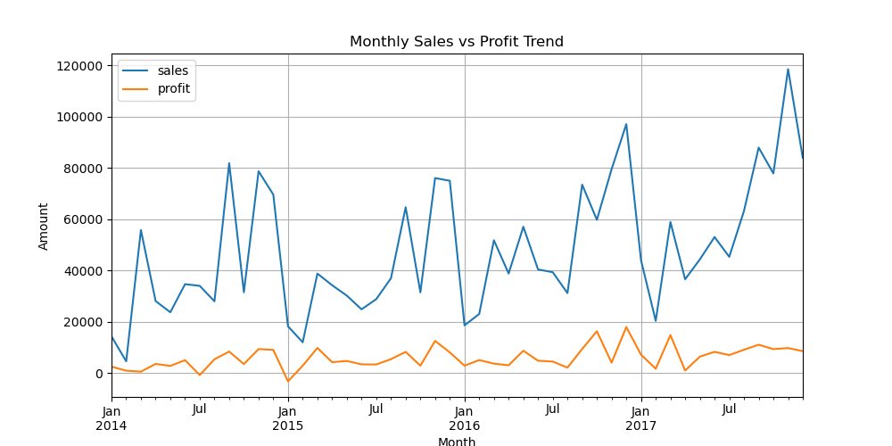
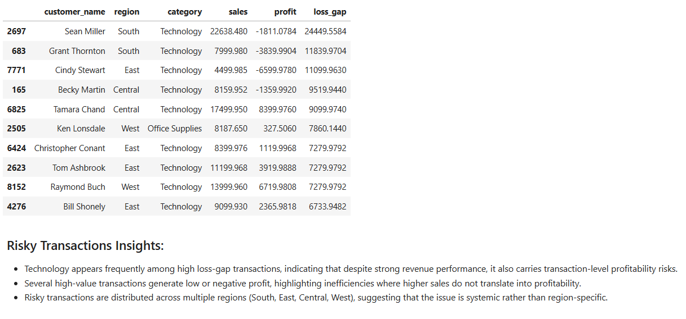

# 📊 Superstore Business Analysis using Python

Advanced business analytics case study using Python, Pandas, and Matplotlib to evaluate profitability, revenue quality, business risk, variance patterns, and operational efficiency.

This project focuses not only on revenue growth, but also on understanding why strong sales do or do not translate into sustainable profitability.

---

# 🎯 Business Objective

The objective of this analysis is to:

* Evaluate revenue quality and profitability drivers
* Identify inefficient categories and loss-making patterns
* Detect variance, volatility, and seasonal behavior
* Analyze customer, segment, state, and regional performance
* Investigate transaction-level profitability risks
* Generate business-focused insights and strategic recommendations
* Automate summary outputs and reporting tables

---

# 🛠️ Tools & Libraries

* Python
* Pandas
* NumPy
* Matplotlib
* Jupyter Notebook

---

# 📂 Repository Structure

```text
superstore-business-analysis-python/
│
├── dataset/
│   └── superstore_cleaned.csv
│
├── notebook/
│   └── superstore_analysis.ipynb
│
├── outputs/
│   ├── category_summary.csv
│   ├── quarterly_summary.csv
│   └── state_summary.csv
│
├── screenshots/
│   ├── Category_analysis.png
│   ├── Revenue_vs_Profit_monthly_trend.png
│   ├── Risky_transactions.png
│   ├── Top_performing_states.png
│   └── Final_conclusion.png
│
└── README.md
```

---

# 🔍 Key Analysis Areas

## 📈 Revenue & Profit Trend Analysis

* Monthly sales vs profit trend analysis
* Rolling trend evaluation
* Growth consistency assessment
* Seasonal pattern identification
* Quarter-wise variance analysis

---

## 🧩 Category & Segment Performance

* Category-wise profitability comparison
* Segment contribution analysis
* Revenue vs profit distribution
* Margin efficiency analysis
* Category risk identification

---

## 🌍 Geographic Analysis

* State-wise sales and profitability analysis
* Regional efficiency comparison
* Profit margin evaluation
* Loss concentration analysis

---

## ⚠️ Risk & Variance Analysis

* Transaction-level anomaly detection
* High discount risk analysis
* Loss-driver investigation
* Profit volatility assessment
* Stability analysis across segments
* Lag-based month-over-month analysis

---

## 🤖 Automated Outputs

The project automatically generates:

* Summary CSV reports
* Aggregated business tables
* Analytical charts
* KPI summaries
* Performance comparison outputs

---

# 📸 Sample Analysis Screenshots

## 📈 Monthly Sales vs Profit Trend



---

## ⚠️ Risky Transaction Analysis



---

# 💡 Key Business Insights

* Strong revenue growth does not always translate into strong profitability.
* Technology is the primary profit driver with high efficiency and strong margins.
* Furniture generates substantial revenue but suffers from weak profitability and margin pressure.
* Heavy discounting is strongly associated with negative profit outcomes.
* Seasonal demand patterns show recurring Q3–Q4 strength and Q1 slowdowns.
* Consumer segment drives most revenue but exhibits higher volatility.
* Regional and transaction-level inefficiencies contribute significantly to unstable profitability.

---

# 📌 Strategic Recommendations

* Reduce dependency on aggressive discounting.
* Improve pricing discipline within Furniture subcategories.
* Focus on stable, high-margin customer segments.
* Optimize regional execution in low-efficiency areas.
* Improve profit conversion instead of focusing only on topline sales growth.
* Use seasonal patterns for inventory and promotional planning.

---

# 📊 Example Analytical Dimensions Covered

* Revenue Quality Analysis
* Profitability Diagnostics
* Variance Analysis
* Rolling Trend Analysis
* Lag Analysis
* Contribution Analysis
* Transaction Risk Detection
* Stability & Volatility Analysis
* Anomaly Detection
* Business Recommendation Framework

---

# 🚫 Scope & Limitations

This project is focused on descriptive and diagnostic analytics using historical Superstore data.

It does not include:

* Machine Learning
* Forecasting models
* Real-time automation pipelines
* Predictive optimization systems

---

# 👨‍💻 Author

Hitesh Garg
Data Analyst | SQL • Power BI • Excel • Python • Finance Analytics
